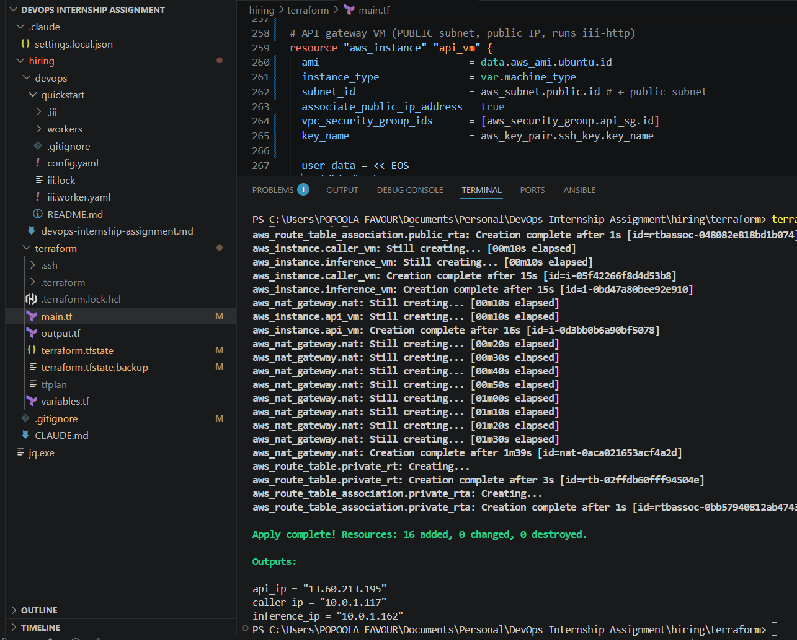
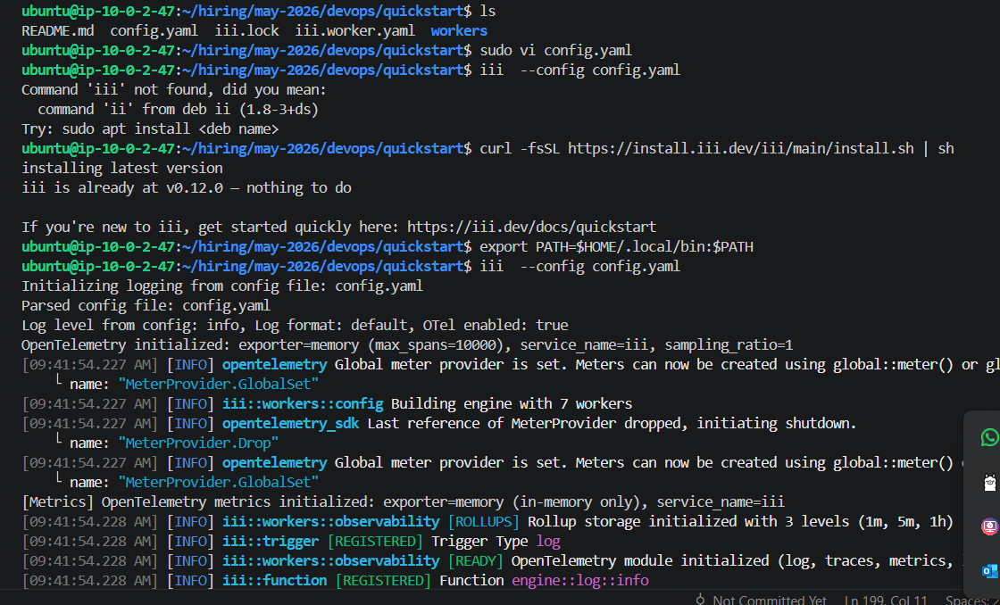
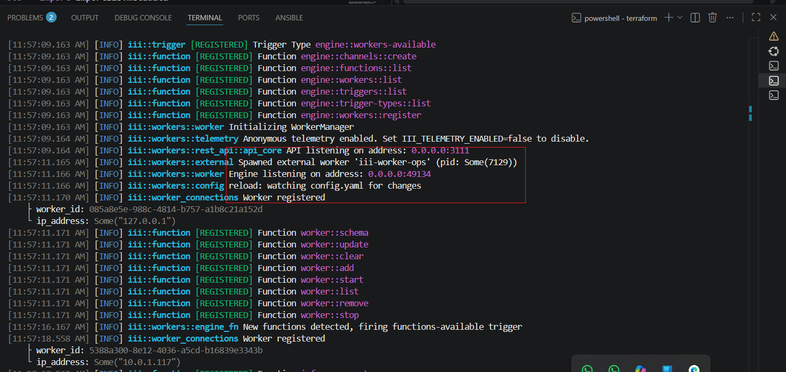
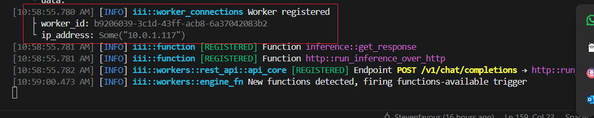
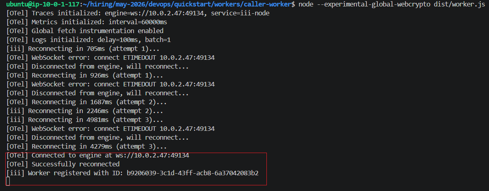
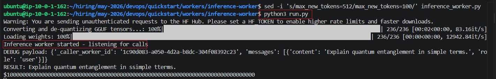
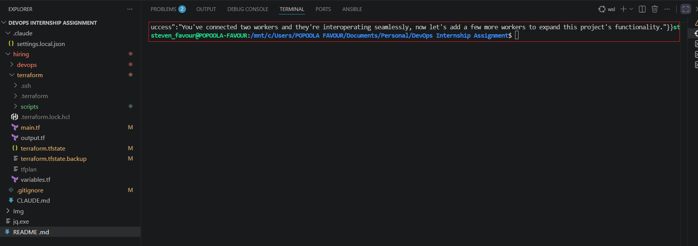
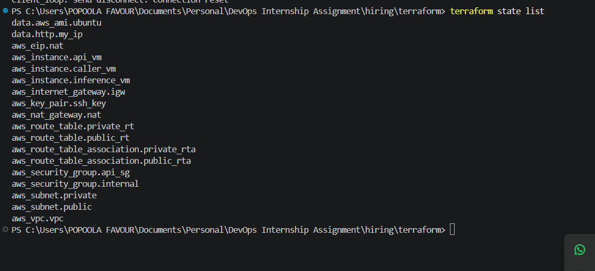
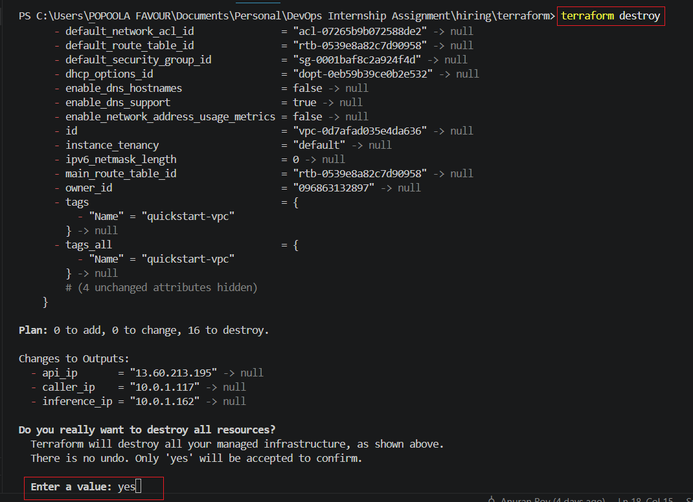
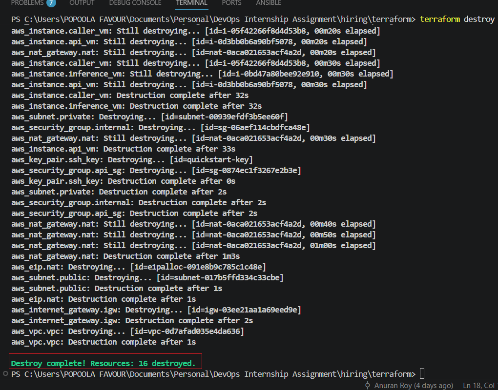

# III Quickstart — Multi-VM Deployment on AWS

A distributed inference stack running the [III engine](https://iii.dev) across three AWS EC2 instances in a private VPC. An HTTP API on a public VM routes requests through a TypeScript caller worker to a Python inference worker running a quantized Gemma model — all communicating over WebSocket RPC through the III engine.

---

## Architecture

```
                         Internet
                             │
                    ┌────────▼─────────┐
                    │   Your Machine   │
                    │  curl :3111      │
                    └────────┬─────────┘
                             │ HTTP POST
                             ▼
        ┌────────────────────────────────────────┐
        │           PUBLIC SUBNET 10.0.2.0/24    │
        │                                        │
        │   ┌──────────────────────────────┐     │
        │   │       API VM                 │     │
        │   │   ip-10-0-2-47               │     │
        │   │   Public IP: 13.60.213.195   │     │
        │   │                              │     │
        │   │   iii engine                 │     │
        │   │   iii-http  → port 3111      │     │
        │   │   ws engine → port 49134     │     │
        │   └──────────────────────────────┘     │
        │              │   NAT Gateway            │
        └──────────────┼─────────────────────────┘
                       │ WebSocket RPC
                       │ ws://10.0.2.47:49134
        ┌──────────────┼─────────────────────────┐
        │              │                          │
        │   PRIVATE SUBNET 10.0.1.0/24            │
        │              │                          │
        │    ┌─────────┴──────┐  ┌─────────────┐ │
        │    │  Caller VM     │  │ Inference VM │ │
        │    │  ip-10-0-1-117 │  │ ip-10-0-1-162│ │
        │    │  No public IP  │  │ No public IP │ │
        │    │                │  │              │ │
        │    │ caller-worker  │  │inference-    │ │
        │    │ (TypeScript)   │  │worker        │ │
        │    │                │  │(Python+Gemma)│ │
        │    └────────────────┘  └─────────────┘ │
        └─────────────────────────────────────────┘

RPC Flow:
curl → iii-http (API VM) → caller-worker (Caller VM) → inference-worker (Inference VM)
                                                              ↓
                                                       Gemma 3 270M model
                                                              ↓
Response ←──────────────────────────────────────────────────────
```

---

## Prerequisites

- [Terraform](https://developer.hashicorp.com/terraform/install) >= 1.5
- AWS CLI configured with credentials (`aws configure`)
- An AWS account (free tier is sufficient)
- SSH key pair (generated locally)

---

## Quickstart — Deploy from Scratch

### 1. Clone the repository

```bash
git clone https://github.com/Alchemyst-ai/hiring.git
cd hiring/may-2026/devops
```

### 2. Generate an SSH key pair

```bash
mkdir -p terraform/.ssh
ssh-keygen -t rsa -b 4096 -f terraform/.ssh/id_rsa -N ""
```

### 3. Set Terraform variables

Create `terraform/terraform.tfvars`:

```hcl
region       = "eu-north-1"
zone         = "eu-north-1a"
machine_type = "t3.medium"
```

### 4. Provision the infrastructure

```bash
cd terraform
terraform init
terraform apply
```

Terraform will output three IP addresses:

```
api_ip        = "13.60.213.195"   # public
caller_ip     = "10.0.1.117"      # private
inference_ip  = "10.0.1.162"      # private
```

---


## Infrastructure Overview

The Terraform configuration provisions:

| Resource | Description |
|---|---|
| VPC `10.0.0.0/16` | Isolated network |
| Public subnet `10.0.2.0/24` | Hosts the API VM and NAT Gateway |
| Private subnet `10.0.1.0/24` | Hosts caller and inference VMs |
| Internet Gateway | Allows public subnet outbound/inbound traffic |
| NAT Gateway | Allows private VMs to reach the internet (for installs) |
| Security group `api_sg` | Opens port 3111 (public), 22 (your IP only), 49134 (from private subnet) |
| Security group `internal` | Opens all TCP traffic within the private subnet + from public subnet |
| 3x EC2 `t3.medium` | Ubuntu 22.04 LTS |

---

## Deploying the Workers

SSH access to private VMs goes through the API VM as a jump host.

### SSH into the API VM

```bash
ssh -i terraform/.ssh/id_rsa ubuntu@<api_ip>
```

### SSH into private VMs (via jump)

```bash
# Caller VM
ssh -A -i terraform/.ssh/id_rsa -J ubuntu@<api_ip> ubuntu@<caller_ip>

# Inference VM
ssh -A -i terraform/.ssh/id_rsa -J ubuntu@<api_ip> ubuntu@<inference_ip>
```

> **Tip:** Add `-A` to forward your SSH agent so no key needs to be copied to the API VM.

---

### API VM Setup

SSH into the API VM and run:

```bash
# Install dependencies
sudo apt-get update && sudo apt-get install -y curl jq git

# Install the III engine
curl -fsSL https://install.iii.dev/iii/main/install.sh | sh
export PATH="$HOME/.local/bin:$PATH"
echo 'export PATH="$HOME/.local/bin:$PATH"' >> ~/.bashrc

# Clone the repo
git clone --depth 1 --filter=blob:none --sparse https://github.com/Alchemyst-ai/hiring.git
cd hiring
git sparse-checkout set may-2026/devops
cd may-2026/devops/quickstart
```

Create `config.yaml`:

```yaml
workers:
  - name: iii-observability
    config:
      enabled: true
      service_name: iii
      exporter: memory
      memory_max_spans: 10000
      logs_enabled: true
      logs_console_output: true
      sampling_ratio: 1.0
  - name: iii-http
    config:
      port: 3111
      host: 0.0.0.0
      default_timeout: 120000
      cors:
        allowed_origins:
          - '*'
        allowed_methods:
          - GET
          - POST
          - PUT
          - DELETE
          - OPTIONS
```

Start the engine:

```bash
iii --config config.yaml
```

Confirm it's ready when you see:

```
Engine listening on address: 0.0.0.0:49134
API listening on address: 0.0.0.0:3111
```




---

### Caller VM Setup

SSH into the caller VM and run:

```bash
# Install dependencies
sudo apt-get update && sudo apt-get install -y curl jq git

# Install Node.js 18
curl -fsSL https://deb.nodesource.com/setup_18.x | sudo -E bash -
sudo apt-get remove -y nodejs libnode-dev libnode72
sudo apt-get autoremove -y
sudo apt-get install -y nodejs
node --version  # should show v18.x.x

# Install the III engine
curl -fsSL https://install.iii.dev/iii/main/install.sh | sh
export PATH="$HOME/.local/bin:$PATH"
echo 'export PATH="$HOME/.local/bin:$PATH"' >> ~/.bashrc

# Clone the repo
git clone --depth 1 --filter=blob:none --sparse https://github.com/Alchemyst-ai/hiring.git
cd hiring
git sparse-checkout set may-2026/devops
cd may-2026/devops/quickstart/workers/caller-worker

# Install and build
npm install
npm update iii-sdk
npm run build
```

Set the III engine URL permanently and start the worker:

```bash
echo 'export III_URL=ws://<api_private_ip>:49134' >> ~/.bashrc
source ~/.bashrc

# Start the worker (Node 18 requires the webcrypto flag)
node --experimental-global-webcrypto dist/worker.js
```

Confirm it's connected when you see:

```
[iii] Worker registered with ID: <uuid>
```

---




### Inference VM Setup

SSH into the inference VM and run:

```bash
# Install dependencies
sudo apt-get update && sudo apt-get install -y curl jq git python3-pip

# Install the III engine
curl -fsSL https://install.iii.dev/iii/main/install.sh | sh
export PATH="$HOME/.local/bin:$PATH"
echo 'export PATH="$HOME/.local/bin:$PATH"' >> ~/.bashrc

# Clone the repo
git clone --depth 1 --filter=blob:none --sparse https://github.com/Alchemyst-ai/hiring.git
cd hiring
git sparse-checkout set may-2026/devops
cd may-2026/devops/quickstart/workers/inference-worker

# Install Python dependencies
python3 -m pip install transformers torch --index-url https://download.pytorch.org/whl/cpu
python3 -m pip install --upgrade --force-reinstall "gguf>=0.10.0"
python3 -m pip install "jinja2>=3.1.0" --upgrade
python3 -m pip install accelerate
```

Create a `run.py` wrapper in the worker directory to fix a known version-detection bug in `transformers`:

```python
# run.py
import importlib.metadata
import transformers.utils.import_utils as tu

# Patch: transformers' PACKAGE_DISTRIBUTION_MAPPING does not include 'gguf',
# causing is_gguf_available() to return False even when gguf is installed.
tu.PACKAGE_DISTRIBUTION_MAPPING["gguf"] = ["gguf"]

import inference_worker
```

Set the III engine URL permanently and start the worker:

```bash
echo 'export III_URL=ws://<api_private_ip>:49134' >> ~/.bashrc
source ~/.bashrc

python3 run.py
```

Confirm the model loads and the worker connects:

```
Converting and de-quantizing GGUF tensors...: 100%
Inference worker started - listening for calls
```


---


## Testing the API

Once all three VMs are running, test end-to-end from your local machine:

```bash
curl -X POST http://<api_public_ip>:3111/v1/chat/completions \
  -H "Content-Type: application/json" \
  -d '{"messages": [{"role":"user","content":"Explain quantum entanglement in simple terms."}]}'
```

### Sample Request

```json
{
  "messages": [
    {
      "role": "user",
      "content": "Explain quantum entanglement in simple terms."
    }
  ]
}
```

### Sample Response

```json
{
  "result": {
    "result": "Quantum entanglement is a phenomenon where two particles...",
    "success": "You've connected two workers and they're interoperating seamlessly, now let's add a few more workers to expand this project's functionality."
  }
}
```


### Request/Response Schema

| Field | Type | Description |
|---|---|---|
| `messages` | `array` | Array of `{role, content}` message objects |
| `messages[].role` | `string` | `"user"` or `"assistant"` |
| `messages[].content` | `string` | The message text |
| `result.result` | `string` | Raw model output |
| `result.success` | `string` | Confirmation message from the caller worker |

---

## Tearing Down

Once you have completed testing and verified the end-to-end flow, destroy all
provisioned infrastructure to avoid ongoing AWS charges. The NAT Gateway in
particular incurs hourly costs even when idle.

Run from the `terraform/` directory:

```bash
cd terraform
terraform destroy
```

Terraform will display a list of all resources to be deleted and prompt for
confirmation. Type `yes` to proceed. This removes all VMs, the NAT Gateway,
Elastic IP, subnets, security groups, route tables, Internet Gateway, and the
VPC in one operation.

> **Important:** Run `terraform destroy` as soon as you are done. The NAT
> Gateway accrues charges at roughly $0.045/hour (~$32/month) regardless of
> traffic. The three `t3.medium` instances add another ~$0.15/hour combined.
> Leaving the stack running overnight will consume a meaningful portion of your
> free credits.

To verify everything was cleaned up, check the AWS console under:
- **EC2 → Instances** — all three instances should be terminated
- **VPC → NAT Gateways** — should show no active gateways
- **VPC → Elastic IPs** — should show no allocated IPs (unallocated EIPs also
  incur charges)

```bash
cd terraform
terraform destroy
```

This removes all VMs, the NAT Gateway, subnets, security groups, and the VPC.






---

## Known Issues and Workarounds

| Issue | Cause | Fix |
|---|---|---|
| `crypto is not defined` on caller worker | Node 18 doesn't expose `crypto` globally | Run with `node --experimental-global-webcrypto dist/worker.js` |
| `is_gguf_available() = False` despite gguf being installed | `transformers` doesn't include `gguf` in its `PACKAGE_DISTRIBUTION_MAPPING` | Use `run.py` wrapper to patch the mapping before import |
| `jinja2` version error | Ubuntu 22.04 ships jinja2 3.0.3 | Run `python3 -m pip install "jinja2>=3.1.0" --upgrade` |
| Node.js version conflict on install | Ubuntu ships Node 12, conflicts with Node 18 | Remove `libnode-dev` and `libnode72` before installing Node 18 |
| Disk space exhaustion on inference VM | PyTorch + model weights are large | Use `t3.medium` with 20GB root volume; install CPU-only torch |

---

## Production Hardening

Several changes would be necessary before running this stack in production:

**Process supervision.** Workers are currently started manually in foreground terminals. They should be wrapped in systemd units so they restart automatically on failure or reboot. Each worker's `III_URL` should be set in the systemd `Environment=` directive.

**Network hardening.** The internal security group currently allows all TCP traffic from both subnets. This should be tightened to only the specific ports required: `49134` for III engine WebSocket connections, and `22` for SSH from the API VM only.

---

## Scaling to a 100x Larger Model

**GPU instances.** CPU inference at that scale would be impractically slow. The inference VM would need to move to a GPU instance (AWS `g4dn.xlarge` or `g5.xlarge`), with the model loaded in half-precision (fp16) or with more aggressive quantization (Q4 instead of Q8). The Terraform configuration would need a separate instance type variable for the inference VM and a node selector if moving to Kubernetes.

**Model storage.** A 27B Q8 model weighs roughly 27GB — too large to download on every cold start. The GGUF file should be stored in S3 and pulled to a persistent EBS volume that survives instance restarts. An instance startup script would check if the model is already on disk before downloading.

**Horizontal scaling and Kubernetes.** The III worker architecture maps cleanly to Kubernetes pods. The API VM becomes a Deployment with a ClusterIP Service on port 49134, the caller worker becomes its own Deployment scaling on HTTP request volume via KEDA, and the inference worker becomes a Deployment on a GPU node pool. Each pod sets `III_URL` to the engine's Kubernetes DNS name. This allows caller workers to scale independently of inference workers, which is important when inference is the bottleneck.

**The benefits in Kubernetes specifically:**

- Each pod scales independently with HorizontalPodAutoscaler
- Inference pods can run on GPU nodes while caller pods run on cheap CPU nodes using nodeSelector
- Workers can be in different namespaces or even different clusters as long as they can reach the engine
- Rolling updates to one worker don't affect others


